  
  
  

 

## 📌 Snapshot

| | |
|---|---|
| 🎓 **Education** | B.E. Artificial Intelligence & Machine Learning — VSB Engineering College *(2023–2027, CGPA 8.41)* |
| 🧭 **Focus** | Full-stack development (Java + React ecosystem) with applied Machine Learning |
| 🏢 **Internships** | Infosys Internship 5.0 · ServiceNow University |
| 🌱 **Building now** | MarketMind — an AI startup-validation SaaS (LangGraph + FastAPI + Next.js) |
| 🎯 **Looking for** | Entry-level Software Engineer / ML Engineer roles |

 

## 🧰 Skills

<table>
<tr>
<td valign="top" width="50%">

**Core & Web**

**Frameworks**

</td>
<td valign="top" width="50%">

**AI / ML**

**Tools**

</td>
</tr>
</table>

**Concept strength**

`Linear & Logistic Regression` `Decision Trees` `Random Forest` `KNN` `Neural Networks` `REST APIs` `OOP`

 

## 🌟 Project Spotlight

<table>
<tr>
<td width="100%">

### 🧩 MarketMind — AI-Powered Startup Validation Platform

Converts raw startup ideas into structured, investor-ready validation reports using AI workflows.

- ⚙️ Multi-step AI reasoning pipeline built with **LangGraph + FastAPI**
- 💳 **Clerk** authentication and **Stripe**-backed subscriptions
- 🗄️ **PostgreSQL** as the system of record
- 🖥️ Polished, responsive dashboard in **Next.js**

`Next.js` · `FastAPI` · `LangGraph` · `PostgreSQL` · `Clerk` · `Stripe`

</td>
</tr>
</table>

<b>🗂️ More projects (click to expand)</b>

 

**🎫 SmartDesk — IT Help Desk Platform**
Full-stack ticketing system with REST APIs for auth and ticket CRUD, priority/status tracking, and a planned AI insights module for automated triage.
`Java` `Spring Boot` `JPA/Hibernate` `MySQL` `React` `Bootstrap`

**✈️ FlightEase — Airline Reservation System**
Web-based flight booking and passenger management system with structured database integration.
`Java` `Servlets` `JSP` `HTML` `CSS`

**🔨 Online Auction Platform** *(built during Infosys Internship 5.0)*
Real-time bidding platform with user authentication and responsive UI.
`Java` `Servlets` `JSP` `MySQL`

 

## 💼 Experience

**Infosys Internship 5.0** · *Feb – Mar 2025*
Built an Online Auction Platform (Java, Servlets, JSP, MySQL) — user authentication, product listing, real-time bidding, responsive UI.

**ServiceNow University — Virtual Internship** · *Apr 2026*
ServiceNow administration, workflow automation with Flow Designer, Agentic AI basics, reporting tools, CSA certification prep.

 

## 🏅 Certifications

  

 

## 📊 GitHub Overview

  
  

  

  

<picture>
  <source media="(prefers-color-scheme: dark)" srcset="https://raw.githubusercontent.com/Ranithaa28/Ranithaa28/output/github-contribution-grid-snake-dark.svg">
  <source media="(prefers-color-scheme: light)" srcset="https://raw.githubusercontent.com/Ranithaa28/Ranithaa28/output/github-contribution-grid-snake.svg">
  
</picture>

 

**📩 Open to Software Engineer / ML Engineer roles — let's connect!**

